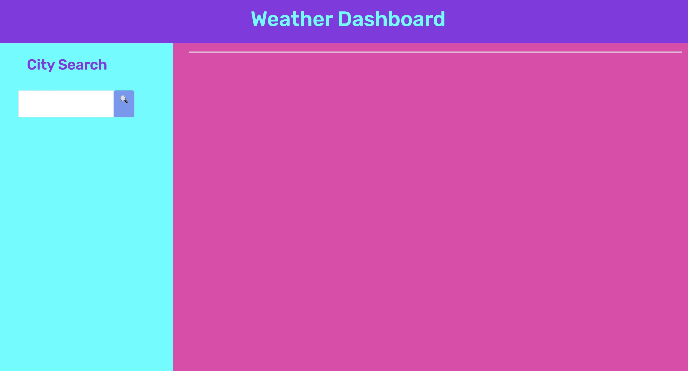
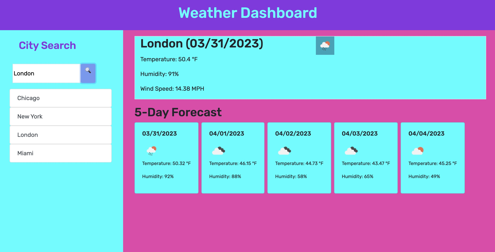
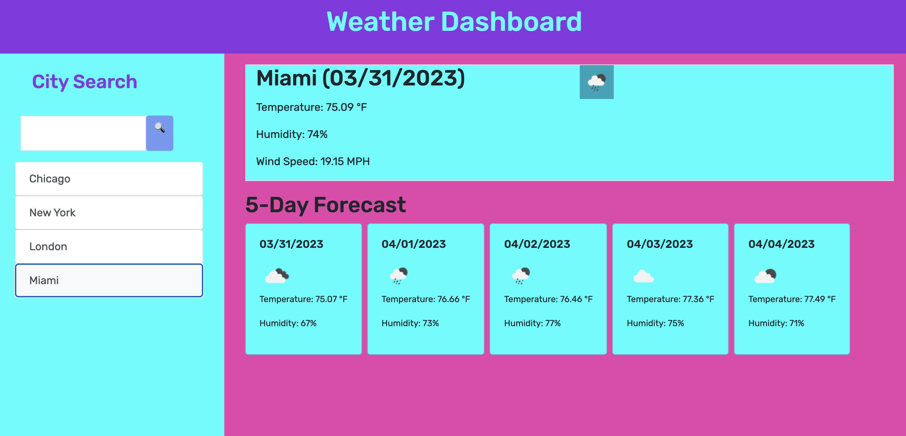

# Homework 06 - Weather Dashboard

## Description

For this assignment, I was tasked with building a website from scratch to act as a Weather Dashboard, where a user can search a city and get the current weather along with a five day forecast.

## Installation

N/A

## Usage

The user will be presented with a webpage of the title "Weather Dashboard" and a "City Search" box. 

 After entering a city and clicking the icon, the user will be presented with the current weather on top and the forecast for the next five days on the bottom. Additonally, the city will be added to the previous search list located beneath the search box.

The user can also click on any of the previous searches to search again.

## Credits

Big thank you to my friends, coders, and personal tutors Cameron Gibson and Daniel Batch for walking me through this one and assisting with the data mining. I used starter code for the JavaScript from GitHub, where I was able to refactor and build out the rest of the application. The styling is all me, taking inspiration from a Caboodles makeup organizer. Trusty W3 Schools helped to fill in some gaps and trusty Chat GBT was used when I was very, very stuck. 

Finally, big thanks to my classmates and our fearless leaders Bryan and Shawn.

## License

Please refer to the LICENSE in the repository.

## Deloyed

Github: https://github.com/JasperJackalope/06homework-weather-dashboard

Website: https://jasperjackalope.github.io/06homework-weather-dashboard/